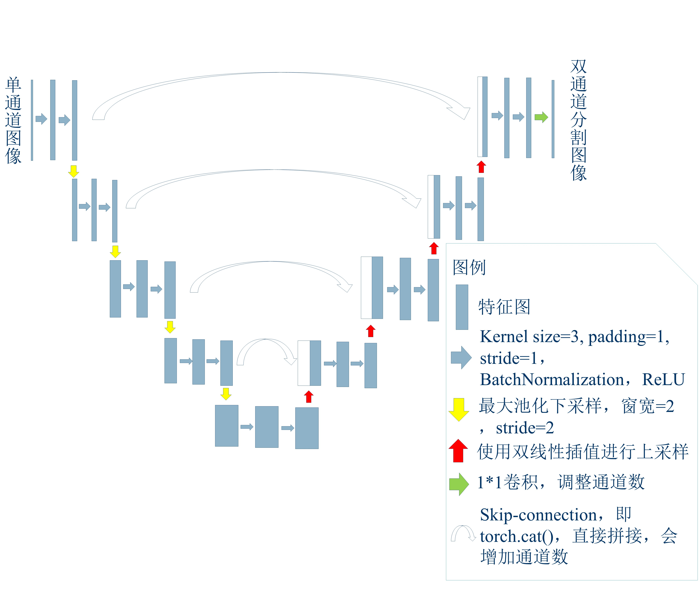
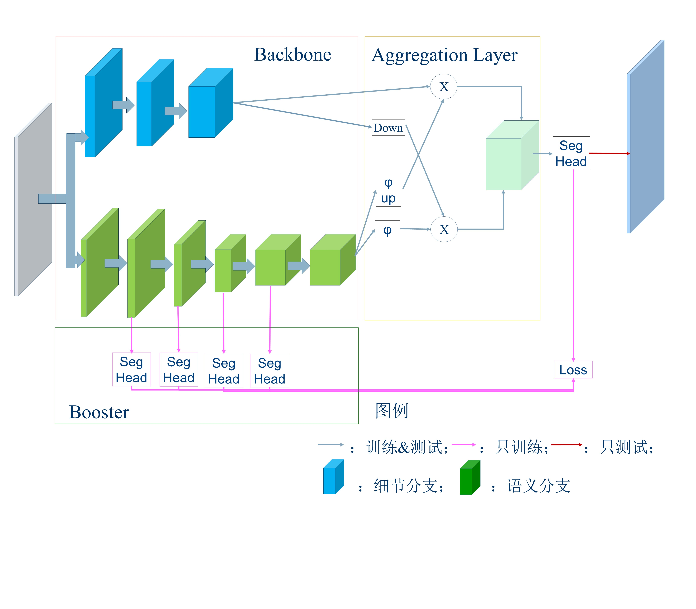

# Visualization-Platform-for-COVID-19-Focus-Segmentation
## Comprehensive Training of Intelligent Platform Design and Application work
This platform is mainly divided into four modules: 
1.*File Upload Module* 
This module is convenient for users to import nii files locally for subsequent visualization and data import of models. 
2.*Data Visualization Module* 
This module is designed to facilitate users to view the imported specific images and the results of model segmentation, and needs to have the function of adjusting the window level and window width that general medical image software has. 
3.*Model Inference Module* 
This module consists of two parts, one is to import the trained model, the other is to infer the data. 
4.*Inference Result Export Module* 
The module should be able to convert the reasoning results into files in the nii format and output them to local folders. 
 
Based on the performance difference between UNet and BiSeNetV2, two reasoning modes are designed for the platform: the classic mode and the fast mode, respectively to meet the needs of GPU in the environment and users for real-time. 
You can retrain models in 'src/train.ipynb' 
**UNet**

**BiSeNetV2**

The platform UI is developed using PyQt5. After being packaged into an exe file, it can run directly on the user's Windows computer without installing other dependent libraries. 
**MainUI** 

